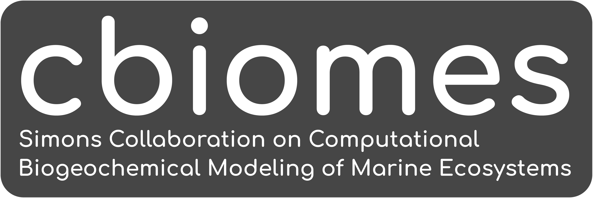

# CBIOMES Community

The Simons Collaboration on Computational Biogeochemical Modeling of Marine Ecosystems (CBIOMES; <https://cbiomes.org>) seeks to develop and apply quantitative models of the structure and function of marine microbial communities at seasonal and basin scales.

